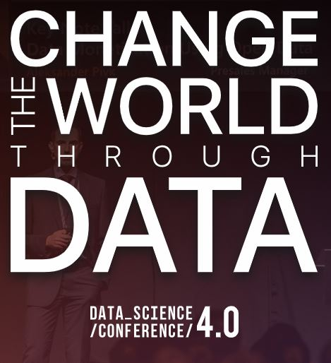

# Datascience 4.0 - Machine learning preconference course

# About the course
Course is planned to be held on 17th of September as part of the Datascience 4.0 conference devoted to the field of Data science. Course goal is to introduce the field of Machine learning to participants through a practical approach, but also point participants in the right direction when it comes to the theoretical approach.

# About the instructor
The course will be held by Milan Cugurovic, [Faculty of Mathematics](http://www.matf.bg.ac.rs/eng/), [University of Belgrade](http://www.bg.ac.rs/en/).
He is interested in various fields of Machine learning both its theoretical and practical side.
Mathematician at heart, a programmer in practise - machine learning guy!  
Go right now and check what's happening on [MATF Machine Learning and Applications Group](http://machinelearning.math.rs/)!

# Abstract
## Introduction to Machine Learning algorithms using scikit-learn
Machine learning (ML) is a field of Artificial Intelligence which has produced incredible breakthroughs in the last decades and is extensively used in industry today. Some of the breakthroughs are system Watson winning in quiz Jeopardy! in 2011, autonomous car driving, image classification (accuracy of which exceeds the one one of the average human), and Google‘s AlphaGo beating world champion in Go in 2016.

Course aims to introduce pariticipants to the basics of machine learning, to give explanations of supervised, unsupervised and reinforcement learning, and also to give an understanding of some of the most widely applied algorithms from the field in problems of regression and classification. Course will cover algorithms like K-Nearest Neighbours, Decision Trees, Logistic and Linear Regression, Neural Networks, and K-Means. Course will also show how to evaluate models produced by algorithms and how to recognize and handle underfitting and overfitting. Algorithms will be applied using Python and scikit-learn library on real life data, but they will also be discussed from a theoretical perspective.

# Knowledge requirements
* Basic programming knowledge
* Basic Python knowledge  
If you want to bring yourself up to speed with Python, check the following free [video tutorial](https://www.youtube.com/watch?v=HBxCHonP6Ro&list=PL6gx4Cwl9DGAcbMi1sH6oAMk4JHw91mC_).

# What we will use
* Python3
* [Jupyter notebook](http://jupyter.org/try)
* Python library: numpy
* Python library: pandas
* Python library: matplotlib
* Python library: scikit-learn

# How to install libraries
## Windows
It is recommended to use [Anaconda](https://www.anaconda.com/download/) (for Python3) to avoid manual install of required libraries.
## Linux
You can also use Anaconda, though you should generally referer to your distribution's recommended way of installing libraries.
